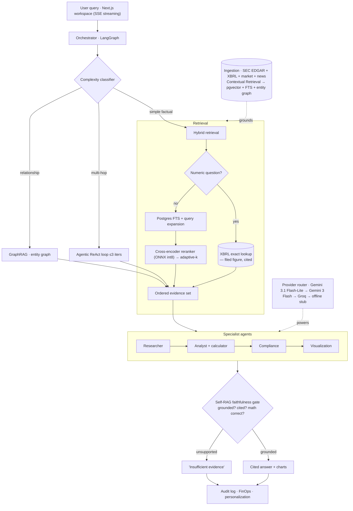

# FinCopilot — the financial analyst copilot that refuses to guess

> A multi-agent, adaptive-RAG research platform for public equities. A team of
> specialist AI agents reads **real SEC filings**, looks up **exact figures from XBRL**,
> runs the analysis, checks compliance, and returns a **fully cited** answer — or
> honestly says **"insufficient evidence."** Built end-to-end on **free-tier
> infrastructure**.

[](https://github.com/krish2105/FinCopilot-/actions/workflows/ci.yml)
&nbsp;·&nbsp; **205 backend tests** &nbsp;·&nbsp; **PR-blocking eval gate** &nbsp;·&nbsp; **$0/mo to run**

**▶ Live demo:** **[fin-copilot-six.vercel.app](https://fin-copilot-six.vercel.app)** &nbsp;·&nbsp; **API:** [fincopilot-api-qypb.onrender.com](https://fincopilot-api-qypb.onrender.com)

<!-- Record a ~20s screen capture of the workspace answering a question → docs/media/demo.gif -->


---

## Why this exists

Analysts burn hours reading 100-page filings to answer questions that repeat every
quarter — and generic LLM chatbots **hallucinate financial figures**, which is
disqualifying in finance. The benchmark data is blunt: on **FinanceBench**, GPT-4-Turbo
*with retrieval* got **81% of financial questions wrong or refused**. The failure mode
isn't prose comprehension — it's **lookup and arithmetic**.

FinCopilot is built around that finding. Prose is retrieved; **numbers are looked up**
from the machine-readable XBRL every 10-K is filed with. Every claim traces to a real
filing. Unsupported claims are **refused, not guessed** — and, crucially, the system was
tuned so it stops refusing its *own correct answers* (see [Evaluation](#evaluation)).

## What makes it different

| | Most AI finance tools | FinCopilot |
| --- | --- | --- |
| Numbers | Retrieved from tables (error-prone) | **Looked up from filed XBRL** — exact, cited to the accession number |
| When unsure | Guesses plausibly | **Refuses** — ungrounded figures and bad arithmetic fail a hard gate |
| Retrieval | Vector-only | **Hybrid** (Postgres FTS + optional dense) → **cross-encoder reranker** → adaptive-k |
| Insight | Answers what you ask | **Tells you what changed** — YoY risk diffs, red flags, portfolio risk concentration |
| Cost | Enterprise seat pricing | **Runs entirely on free tiers** |

---

## Architecture



Full detail: [docs/architecture.md](docs/architecture.md) · [DECISIONS.md](DECISIONS.md) · [docs/ROADMAP_2026.md](docs/ROADMAP_2026.md)

---

## Capabilities

### Research & answers
- **Cited Q&A over real 10-Ks/10-Qs** with a route badge, source panel, faithfulness score, and a live provider trace.
- **Exact figures from XBRL** — *"Apple's FY2024 revenue was \$391,035,000,000"*, cited to the SEC accession number, verified by the faithfulness gate.
- **Adaptive routing** — cheap hybrid search for simple lookups, an agentic ReAct loop for multi-hop, GraphRAG for relationship questions.
- **Refuses to guess** — a Self-RAG gate blocks any ungrounded number or wrong calculation.

### Insight layer *(tells you what you didn't ask)*
- **Risk Diff** — what's *new / dropped / escalated* in a company's risk factors year-over-year.
- **Red-flag scanner** — going concern, restatements, material weakness, litigation.
- **Portfolio risk overlap** — *"67% of your holdings are exposed to supply-chain risk."*
- **Fundamentals & peer benchmarking** — revenue/margins/EPS from filed statements.

### Analyst tools
- **DCF valuation** — a transparent two-stage model with **editable assumptions** and a growth × discount-rate **sensitivity heatmap**. The calculator does the math; the LLM never does.
- **Screener** — filter the universe by filed fundamentals (deterministic, no model-written SQL).
- **Market Map** — income-statement **Sankey**, company × risk **heatmap**, and the **entity-graph network**.
- **Live prices, charts & earnings** · **Compare** two companies · **Watchlist** with filing alerts.

### Platform (B2B SaaS)
Multi-tenant data rooms · RBAC + Postgres RLS · usage metering & guarded Stripe billing ·
audit trail · GDPR export/delete · prompt-injection defenses · weekly email digest ·
public trust center + legal pack · installable **PWA**.

---

## Evaluation

Measured on **50 real FinanceBench questions** over real 10-Ks — human-curated, not
self-generated. Numbers are published **as measured, including the bad ones**
([`backend/eval_results/latest.json`](backend/eval_results/latest.json), served at
`GET /eval` and rendered in-app).

The most valuable thing the harness did was catch a real defect. The first run against a
**live LLM** exposed that the faithfulness gate was **refusing 56% of its own correct,
cited answers** — the judge had been told to treat any not-explicitly-stated claim as
fabrication, so it punished legitimate cross-source synthesis. Fixing it (materiality-
aware grading: figures and arithmetic refuse unconditionally; prose doubt is scored):

| Metric | Before fix | After fix |
| --- | --- | --- |
| Faithfulness | 44% | **90%** |
| Refusal rate | 56% | **10%** |
| Context hit | 78% | **92%** |
| Answer match | 42% | **50%** |
| Citation coverage | 100% | **100%** |

Quality can't silently regress: a PR that drops these below committed baselines **fails
CI** ([`backend/tests/test_eval_gate.py`](backend/tests/test_eval_gate.py)).

---

## Tech stack *(every layer free-tier)*

| Layer | Choice |
| --- | --- |
| Orchestration | **LangGraph** state machine · FastAPI · Pydantic |
| LLM | Gemini 3.1 Flash-Lite → Gemini 3 Flash → Groq Llama 3.3 → deterministic offline stub |
| Retrieval | **Postgres full-text search** + optional dense (pgvector) · RRF · Contextual Retrieval |
| Reranker | `ms-marco-MiniLM` cross-encoder as **ONNX int8** (CPU, no torch, fits 512 MB) |
| Exact data | **SEC XBRL** (`data.sec.gov`) — free, keyless, uncapped |
| Vector / metadata DB | Supabase Postgres + pgvector |
| Graph | NetworkX entity graph (company → risk → executive → subsidiary) |
| Frontend | Next.js 14 · TypeScript · Tailwind · Recharts · framer-motion · PWA |
| Auth / billing | Supabase Auth · guarded Stripe |
| Hosting | Vercel (frontend) · Render (backend) · Supabase (DB) — auto-deploy from `main` |
| Eval | FinanceBench harness · RAGAS-wired · PR-blocking gate |

---

## Engineering highlights

The interesting problems solved along the way:

- **Numbers aren't retrieved, they're looked up.** 73% of financial retrieval failures
  are table-structure mismatches, so numeric queries are answered from filed XBRL and
  injected as top-ranked, cited evidence — sidestepping the failure mode entirely.
- **A real reranker on 512 MB.** The cross-encoder — the single dominant RAG component —
  runs as int8 ONNX (no torch), 184 MB peak, ~20 ms/batch.
- **Config that can't drift.** The embedding model is read from the corpus itself, so a
  re-seed can never silently desync the API from its own data.
- **Free-tier resilience.** Quota-aware embedding throttle; graceful degradation to
  lexical-only search when the embedding quota is exhausted; provider fallback to an
  offline stub so a rate-limited LLM never crashes a request.
- **Ingestion where there's no shell.** Render's free tier has no shell, so ingestion
  runs on GitHub Actions straight into Supabase, on a schedule.
- **Two XBRL traps that produce *confidently wrong numbers*** — the `fy` tag is the
  filing's year not the fact's, and companies abandon concept tags — both caught by
  tests, because a wrong number is the one thing this product exists to prevent.

---

## Run it

**Local**
```bash
cp .env.example .env            # optional keys; runs fully offline without any
cd backend && python -m src.ingestion.run --tickers AAPL MSFT --offline
uvicorn src.api.main:app --reload      # API on :8000
cd ../frontend && npm install && npm run dev   # UI on :3000
```

**Deploy** — Vercel (frontend) + Render Blueprint (`render.yaml`) + Supabase (pgvector).
Every external service has a free tier and is independently guarded, so the app runs
with **no keys** and lights up each capability as its key is added. See
[scripts/deploy.md](scripts/deploy.md).

---

## Disclaimer

FinCopilot is an informational research tool. It is **not** investment advice and does
not execute trades. Valuation outputs (e.g. DCF) are transparent calculators driven by
user-editable assumptions, not recommendations. AI-generated content is labeled as such.
