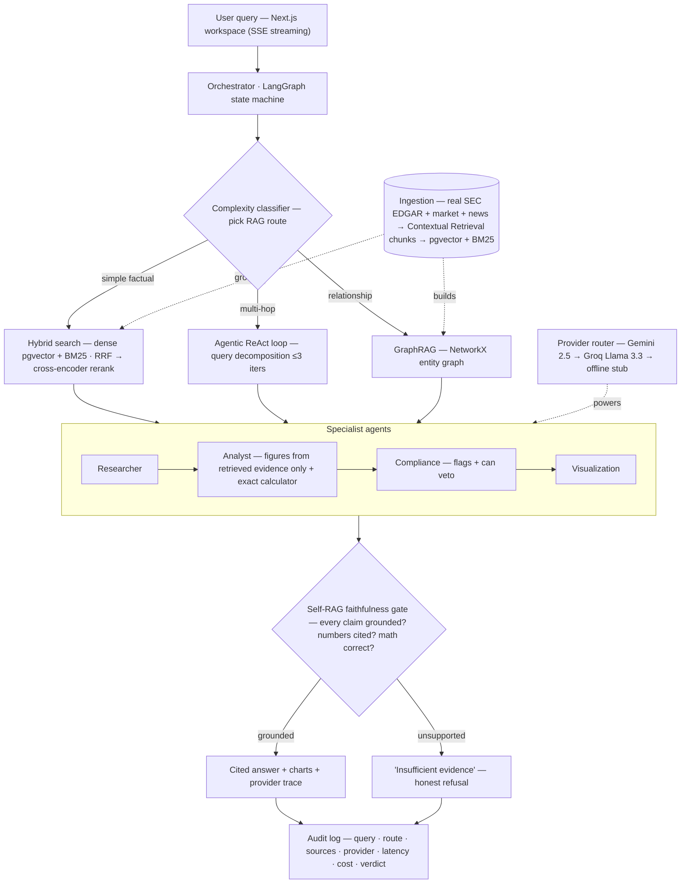

# Architecture

## Diagram

## Request lifecycle

1. **User query** arrives from the Next.js workspace (streaming chat).
2. **Orchestrator** (LangGraph state machine) classifies intent + complexity and picks
   a RAG route.
3. **Adaptive RAG router:**
   - *simple factual* → hybrid search (dense pgvector + BM25) → cross-encoder rerank
   - *multi-hop* → agentic ReAct retrieval loop, capped at 3 iterations, logged
   - *relationship* → GraphRAG over the entity graph
4. **Specialist agents:**
   - **Researcher** — sub-queries, retrieve + rank evidence, attach source metadata
     (ticker, filing type, date, page).
   - **Analyst** — ratios/growth/trends from *retrieved figures only*, citing each
     input line; refuses if a required figure wasn't retrieved.
   - **Compliance** — flags risk-factor / going-concern / restatement / litigation
     language; validates the Analyst's claims; can veto to refusal.
   - **Visualization** — charts/tables from validated figures only.
5. **Self-RAG faithfulness gate** — every claim must be supported by cited context;
   unsupported answers become "insufficient evidence" + what's missing.
6. **Audit log** — query, route, sources, LLM provider used, latency, cost, verdict.

## Component map

| Concern | Module (backend/src) |
| --- | --- |
| Fetch/parse/chunk/embed | `ingestion/` |
| Hybrid search, reranker, GraphRAG, router | `retrieval/` |
| Orchestrator + specialist agents | `agents/` |
| LLM provider fallback router | `providers/` |
| RAGAS harness | `evaluation/` |
| FastAPI app + routes | `api/` |
| Settings + prompts | `config/` |

## Design principle

Complexity is a cost, not a virtue — route the easy ~80% cheaply, reserve
agentic/graph power for the hard ~20%.
